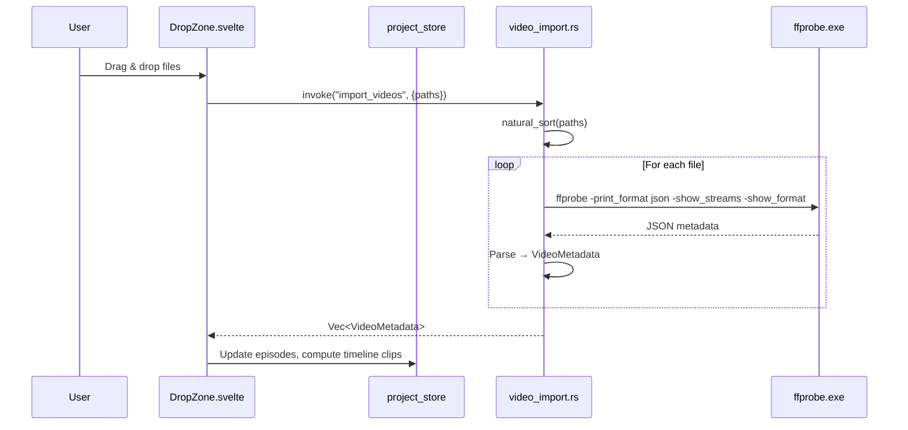
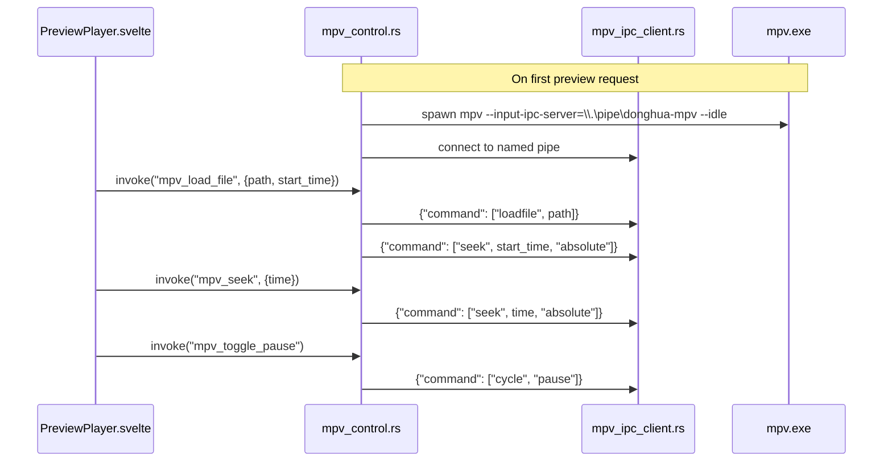
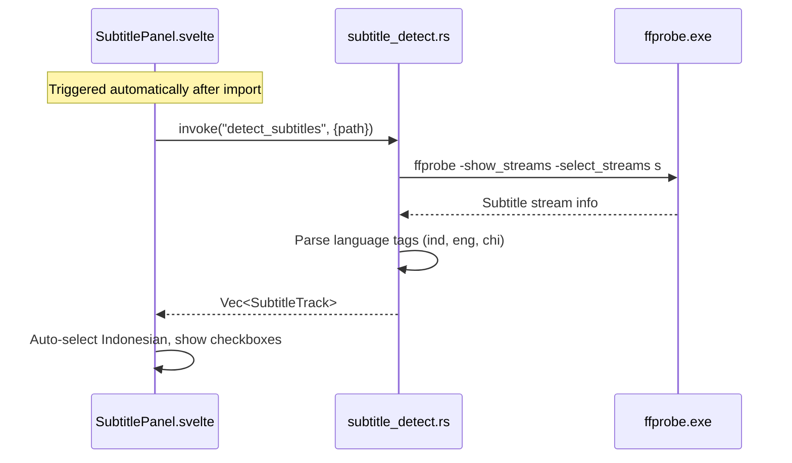

# Donghua Nexus — Software Architecture & Implementation Plan

## Overview

Donghua Nexus is a **100% offline Windows desktop app** for anime/donghua batch video editing. Built with Tauri v2 (Rust backend) + SvelteKit (Svelte 5 frontend). Uses FFmpeg and MPV as external processes via `std::process::Command`.

**Core workflow**: Import season → Cut intro/outro → Burn subtitle → Add watermark → Encode → Single MKV output with chapters.

---

## 1. Architecture Decisions

### Why This Stack

| Decision | Reason |
|----------|--------|
| **Tauri v2 + Rust** | Small binary, low memory, native performance for video metadata processing |
| **Svelte 5** | Reactive UI with minimal overhead, runes for fine-grained reactivity |
| **FFmpeg CLI** | No FFI/binding complexity. `ffprobe` for metadata, `ffmpeg` for encoding. Reliable, well-documented |
| **MPV CLI** | `--input-ipc-server` for JSON IPC control. Frame-accurate seeking, native subtitle/filter support |
| **No wasm/native bindings** | Simpler build, easier debug, fewer deps |

### Architecture Pattern: **Command-Based IPC**

```
┌─────────────────────────────────────────────────┐
│  Frontend (Svelte 5 + SvelteKit)                │
│                                                 │
│  ┌─────────┐ ┌──────────┐ ┌──────────────────┐  │
│  │ Import  │ │ Timeline │ │ Preview (MPV     │  │
│  │ Panel   │ │ Editor   │ │ via <webview>    │  │
│  └────┬────┘ └────┬─────┘ │ or embedded)     │  │
│       │           │       └────────┬─────────┘  │
│       └───────────┴────────────────┘            │
│                    │ invoke()                    │
├────────────────────┼────────────────────────────┤
│  Backend (Rust)    │                            │
│                    ▼                            │
│  ┌─────────────────────────────────────┐        │
│  │  Tauri Command Handlers             │        │
│  │  (thin layer, delegates to modules) │        │
│  └──────┬──────────┬──────────┬────────┘        │
│         │          │          │                  │
│  ┌──────▼──┐ ┌─────▼────┐ ┌──▼──────────┐      │
│  │ ffprobe │ │ mpv_ipc  │ │ ffmpeg_cmd  │      │
│  │_runner  │ │_control  │ │_builder     │      │
│  └─────────┘ └──────────┘ └─────────────┘      │
│         │          │          │                  │
│         ▼          ▼          ▼                  │
│     ffprobe.exe  mpv.exe   ffmpeg.exe            │
│  (D:\...\third-party\...)                       │
└─────────────────────────────────────────────────┘
```

### Key Principles

1. **Rust does all heavy lifting** — file I/O, process spawning, metadata parsing
2. **Svelte only renders** — receives data from Rust via Tauri commands, presents UI
3. **No global mutable state** — Svelte stores are the single source of truth on frontend; Rust is stateless per-command (project state lives in frontend)
4. **MPV as external process** — controlled via JSON IPC pipe, not embedded library
5. **One file = one responsibility** — each Rust module and Svelte component has a clear purpose

---

## 2. Project Folder Structure

```
donghua-nexus/
├── src/                          # Frontend (SvelteKit)
│   ├── app.html
│   ├── app.css                   # Global styles
│   ├── lib/
│   │   ├── stores/               # Svelte 5 state (runes)
│   │   │   ├── project_store.svelte.ts    # Episodes, timeline clips
│   │   │   ├── playback_store.svelte.ts   # Playhead, play state
│   │   │   ├── subtitle_store.svelte.ts   # Subtitle selections
│   │   │   ├── watermark_store.svelte.ts  # Watermark config
│   │   │   ├── chapter_store.svelte.ts    # Chapter list
│   │   │   └── encode_store.svelte.ts     # Encode config & progress
│   │   ├── components/
│   │   │   ├── import/
│   │   │   │   ├── DropZone.svelte        # Drag & drop area
│   │   │   │   └── EpisodeList.svelte     # Sorted file list
│   │   │   ├── timeline/
│   │   │   │   ├── Timeline.svelte        # Main timeline container
│   │   │   │   ├── TimelineTrack.svelte   # Single track row
│   │   │   │   ├── TimelineClip.svelte    # Individual clip block
│   │   │   │   ├── TimelineRuler.svelte   # Time ruler with zoom
│   │   │   │   └── Playhead.svelte        # Draggable playhead
│   │   │   ├── preview/
│   │   │   │   └── PreviewPlayer.svelte   # MPV player area
│   │   │   ├── subtitle/
│   │   │   │   └── SubtitlePanel.svelte   # Subtitle track selection
│   │   │   ├── watermark/
│   │   │   │   └── WatermarkPanel.svelte  # Watermark config UI
│   │   │   ├── chapter/
│   │   │   │   └── ChapterPanel.svelte    # Chapter list editor
│   │   │   ├── encode/
│   │   │   │   └── EncodePanel.svelte     # Output settings & progress
│   │   │   └── shared/
│   │   │       ├── TimeInput.svelte       # HH:MM:SS.mmm input
│   │   │       └── IconButton.svelte      # Reusable button
│   │   ├── types/
│   │   │   └── index.ts                   # TypeScript interfaces
│   │   └── tauri_commands.ts              # Typed wrappers for invoke()
│   └── routes/
│       ├── +layout.svelte                 # App shell layout
│       ├── +layout.ts
│       └── +page.svelte                   # Main editor page (SPA)
│
├── src-tauri/                    # Backend (Rust)
│   ├── Cargo.toml
│   ├── tauri.conf.json
│   ├── build.rs
│   ├── src/
│   │   ├── main.rs                        # Entry point (unchanged)
│   │   ├── lib.rs                         # Tauri builder + command registration
│   │   ├── commands/                      # Tauri command handlers
│   │   │   ├── mod.rs
│   │   │   ├── video_import.rs            # Import & probe video files
│   │   │   ├── mpv_control.rs             # MPV player commands
│   │   │   ├── subtitle_detect.rs         # Detect subtitle tracks
│   │   │   ├── watermark_load.rs          # Load & validate watermark PNG
│   │   │   ├── chapter_generate.rs        # Auto-generate chapters
│   │   │   └── encode_start.rs            # Start FFmpeg encode (future)
│   │   ├── ffprobe_runner.rs              # Run ffprobe, parse JSON output
│   │   ├── ffmpeg_cmd_builder.rs          # Build FFmpeg command args
│   │   ├── mpv_ipc_client.rs             # Named pipe IPC to MPV
│   │   ├── video_metadata.rs              # VideoFile, StreamInfo structs
│   │   ├── subtitle_info.rs              # SubtitleTrack struct
│   │   ├── third_party_paths.rs           # FFmpeg/MPV exe path constants
│   │   └── natural_sort.rs               # Natural sort for filenames
│   ├── capabilities/
│   └── icons/
│
├── static/                       # Static assets
│   └── watermark/                # Default watermark PNG
├── svelte.config.js
├── vite.config.js
├── tsconfig.json
└── package.json
```

### Design Rationale

- **`stores/` uses Svelte 5 runes** — `$state()` and `$derived()` for reactive state. Each store file is a single concern (project, playback, subtitle, watermark, chapter, encode).
- **`commands/` in Rust are thin** — they validate input, call the appropriate module, return result. They do NOT contain business logic.
- **`ffprobe_runner.rs`** — single module that wraps `ffprobe -print_format json`. Returns strongly-typed `VideoMetadata`.
- **`mpv_ipc_client.rs`** — wraps Windows Named Pipe communication to MPV's `--input-ipc-server`.
- **`natural_sort.rs`** — sorts filenames like `Episode 2.mkv` before `Episode 10.mkv` (human-order sort).
- **`third_party_paths.rs`** — hardcoded paths to FFmpeg/MPV executables. No runtime PATH search.

---

## 3. Frontend–Backend Data Flow

### 3.1 Video Import Flow



### 3.2 MPV Preview Flow



> **Note**: MPV window will be a **separate OS window** positioned alongside the app. This is simpler than embedding MPV inside a webview and avoids complex HWND management. Tauri v2 can set MPV's window position to align with the preview area.

### 3.3 Subtitle Detection Flow



### 3.4 Encode Flow (Phase 2+)

```
User clicks "Encode"
  → Svelte sends encode config to Rust
  → Rust builds FFmpeg filter_complex (concat + subtitle burn + watermark overlay)
  → Rust spawns ffmpeg.exe with -progress pipe
  → Rust emits progress events via Tauri event system
  → Svelte updates progress bar
  → On complete: MKV file with chapters written
```

---

## 4. State Management Design

### Svelte 5 Runes (No External Library)

Using Svelte 5's built-in `$state()` rune instead of traditional stores or external state management.

#### `project_store.svelte.ts`
```typescript
// Core state: episodes and timeline
interface Episode {
  id: string;
  filename: string;
  path: string;
  duration_ms: number;        // Duration in milliseconds
  resolution: [number, number]; // [width, height]
  fps: number;
  video_codec: string;
  audio_codec: string;
  audio_bitrate: number;
  file_size_bytes: number;
  subtitles: SubtitleTrack[];
}

interface TimelineClip {
  id: string;
  episode_id: string;
  start_in_source_ms: number;  // Where this clip starts in original file
  end_in_source_ms: number;    // Where this clip ends in original file
  timeline_offset_ms: number;  // Position on the timeline
}

// State
let episodes = $state<Episode[]>([]);
let clips = $state<TimelineClip[]>([]);
let project_title = $state("");

// Derived
let total_duration_ms = $derived(
  clips.reduce((sum, c) => sum + (c.end_in_source_ms - c.start_in_source_ms), 0)
);
```

#### `playback_store.svelte.ts`
```typescript
let playhead_ms = $state(0);     // Current position in ms
let is_playing = $state(false);
let zoom_level = $state(1);      // 1 = default, higher = zoomed in
```

#### `subtitle_store.svelte.ts`
```typescript
interface SubtitleTrack {
  index: number;
  language: string;
  title: string;
  codec: string;       // ass, srt, subrip
  selected: boolean;
}

let selected_subtitle_index = $state<number | null>(null);
```

#### `watermark_store.svelte.ts`
```typescript
let watermark_enabled = $state(true);
let watermark_path = $state("");
let watermark_position = $state<"top-left"|"top-right"|"bottom-left"|"bottom-right">("top-right");
let watermark_scale_percent = $state(10);
let watermark_opacity_percent = $state(70);
let watermark_margin_px = $state(20);
```

#### `chapter_store.svelte.ts`
```typescript
interface Chapter {
  id: string;
  title: string;
  timestamp_ms: number;
}

let chapters = $state<Chapter[]>([]);
// Auto-generated from episodes on import
```

### Design Rationale

- **No Zustand, Redux, or external store library** — Svelte 5 runes provide the same reactivity with zero dependencies
- **Separate store files** — each store handles one concern; no god-object state
- **Milliseconds as time unit** — integers avoid floating-point precision issues, trivial to convert for display
- **`TimelineClip` has `timeline_offset_ms`** — this is the computed position on the output timeline, recalculated after every edit (ripple delete)
- **Undo/redo (Phase 2)** — will use a simple snapshot-diff stack on `clips[]`, not complex command pattern

---

## 5. Phase 1 Implementation Details

### What Phase 1 Delivers

1. **Video Import**: Drag & drop MKV/MP4, natural sort, probe metadata via FFprobe
2. **Timeline**: Single video track, visual clips, playhead, zoom, click-to-seek
3. **MPV Preview**: External MPV window, play/pause, seek, frame-by-frame
4. **Subtitle Detection**: Auto-detect subtitle tracks, language-based auto-select
5. **Watermark Preview**: Config UI with position/scale/opacity controls
6. **Chapter Generation**: Auto-generate chapters from episode boundaries

### Rust Dependencies to Add

```toml
[dependencies]
tauri = { version = "2", features = [] }
tauri-plugin-opener = "2"
serde = { version = "1", features = ["derive"] }
serde_json = "1"
uuid = { version = "1", features = ["v4"] }                # Unique IDs
tokio = { version = "1", features = ["process", "io-util", "net", "rt"] }  # Async process & named pipe
```

> **No other deps needed.** No ffmpeg bindings, no mpv library, no video processing crate.

### NPM Dependencies to Add

```json
{
  "@tauri-apps/plugin-dialog": "^2"  // Native file dialog (alternative to drag-drop)
}
```

### Tauri Permissions to Add

- `dialog:allow-open` — for file picker fallback
- `core:default` — already present
- File system read access — for reading video files by path

### Tauri Config Changes

- Window size: `1440x900` (editor needs more space)
- Window title: `Donghua Nexus`
- Decorations: true
- Resizable: true

---

## Proposed Changes

### Rust Backend

---

#### [NEW] [third_party_paths.rs](file:///d:/Documents/GitHub/donghua-nexus/src-tauri/src/third_party_paths.rs)

Hardcoded paths to FFmpeg and MPV executables. Single source of truth.

```rust
pub const FFMPEG_PATH: &str = r"D:\Documents\GitHub\third-party\ffmpeg\ffmpeg.exe";
pub const FFPROBE_PATH: &str = r"D:\Documents\GitHub\third-party\ffmpeg\ffprobe.exe";
pub const MPV_PATH: &str = r"D:\Documents\GitHub\third-party\mpv\mpv.exe";
```

---

#### [NEW] [video_metadata.rs](file:///d:/Documents/GitHub/donghua-nexus/src-tauri/src/video_metadata.rs)

Structs for video file metadata. Serialized to frontend.

---

#### [NEW] [subtitle_info.rs](file:///d:/Documents/GitHub/donghua-nexus/src-tauri/src/subtitle_info.rs)

Struct for subtitle track info. Includes index, language, title, codec.

---

#### [NEW] [natural_sort.rs](file:///d:/Documents/GitHub/donghua-nexus/src-tauri/src/natural_sort.rs)

Natural sorting for filenames. `Episode 2` before `Episode 10`. Zero-dependency implementation using iterator-based numeric chunk splitting.

---

#### [NEW] [ffprobe_runner.rs](file:///d:/Documents/GitHub/donghua-nexus/src-tauri/src/ffprobe_runner.rs)

Runs `ffprobe -v quiet -print_format json -show_format -show_streams <file>`. Parses JSON output into `VideoMetadata` struct. Returns structured error if file is invalid or ffprobe fails.

---

#### [NEW] [mpv_ipc_client.rs](file:///d:/Documents/GitHub/donghua-nexus/src-tauri/src/mpv_ipc_client.rs)

Manages MPV process lifecycle and JSON IPC via Windows Named Pipe (`\\.\pipe\donghua-mpv-ipc`).

Key methods:
- `spawn_mpv()` — starts MPV with `--idle --no-terminal --input-ipc-server=PIPE`
- `send_command(args)` — sends JSON command to MPV pipe
- `load_file(path)` — loads video file
- `seek(seconds)` — absolute seek
- `toggle_pause()` — play/pause
- `frame_step()` / `frame_back_step()` — frame-by-frame

Uses `tokio::net::windows::named_pipe` for async pipe communication.

---

#### [NEW] [commands/mod.rs](file:///d:/Documents/GitHub/donghua-nexus/src-tauri/src/commands/mod.rs)

Re-exports all command modules.

---

#### [NEW] [commands/video_import.rs](file:///d:/Documents/GitHub/donghua-nexus/src-tauri/src/commands/video_import.rs)

`#[tauri::command] async fn import_videos(paths: Vec<String>) -> Result<Vec<VideoMetadata>>`

1. Natural sort paths
2. Run ffprobe on each
3. Return metadata list

---

#### [NEW] [commands/mpv_control.rs](file:///d:/Documents/GitHub/donghua-nexus/src-tauri/src/commands/mpv_control.rs)

Commands: `mpv_start`, `mpv_load_file`, `mpv_seek`, `mpv_toggle_pause`, `mpv_frame_step`, `mpv_frame_back_step`, `mpv_stop`, `mpv_set_subtitle_visibility`, `mpv_overlay_watermark`.

Manages shared MPV state via `tauri::State<Mutex<MpvIpcClient>>`.

---

#### [NEW] [commands/subtitle_detect.rs](file:///d:/Documents/GitHub/donghua-nexus/src-tauri/src/commands/subtitle_detect.rs)

`#[tauri::command] async fn detect_subtitles(path: String) -> Result<Vec<SubtitleTrack>>`

Runs ffprobe to extract subtitle streams. Detects external `.ass`/`.srt` files with matching filenames.

---

#### [NEW] [commands/watermark_load.rs](file:///d:/Documents/GitHub/donghua-nexus/src-tauri/src/commands/watermark_load.rs)

`#[tauri::command] async fn load_watermark(path: String) -> Result<WatermarkInfo>`

Validates PNG exists, reads dimensions. Returns info for preview.

---

#### [NEW] [commands/chapter_generate.rs](file:///d:/Documents/GitHub/donghua-nexus/src-tauri/src/commands/chapter_generate.rs)

`#[tauri::command] fn generate_chapters(episodes: Vec<EpisodeInput>) -> Vec<Chapter>`

Takes episode list with durations, computes cumulative timestamps.

---

#### [MODIFY] [lib.rs](file:///d:/Documents/GitHub/donghua-nexus/src-tauri/src/lib.rs)

Register all new command handlers. Initialize MPV state. Add tokio runtime for async commands.

---

#### [MODIFY] [Cargo.toml](file:///d:/Documents/GitHub/donghua-nexus/src-tauri/Cargo.toml)

Add `uuid`, `tokio` dependencies.

---

### Svelte Frontend

---

#### [NEW] [app.css](file:///d:/Documents/GitHub/donghua-nexus/src/app.css)

Global stylesheet. Dark theme (anime editor aesthetic). CSS custom properties for colors, spacing, typography.

---

#### [NEW] [types/index.ts](file:///d:/Documents/GitHub/donghua-nexus/src/lib/types/index.ts)

TypeScript interfaces matching Rust structs: `Episode`, `TimelineClip`, `SubtitleTrack`, `WatermarkConfig`, `Chapter`, `VideoMetadata`.

---

#### [NEW] [tauri_commands.ts](file:///d:/Documents/GitHub/donghua-nexus/src/lib/tauri_commands.ts)

Typed wrapper functions around `invoke()`. Single file for all Tauri IPC calls.

---

#### [NEW] [stores/project_store.svelte.ts](file:///d:/Documents/GitHub/donghua-nexus/src/lib/stores/project_store.svelte.ts)

Episodes list, timeline clips, project title. Auto-computes `timeline_offset_ms` when clips change.

---

#### [NEW] [stores/playback_store.svelte.ts](file:///d:/Documents/GitHub/donghua-nexus/src/lib/stores/playback_store.svelte.ts)

Playhead position, play state, zoom level.

---

#### [NEW] [stores/subtitle_store.svelte.ts](file:///d:/Documents/GitHub/donghua-nexus/src/lib/stores/subtitle_store.svelte.ts)

Selected subtitle track index.

---

#### [NEW] [stores/watermark_store.svelte.ts](file:///d:/Documents/GitHub/donghua-nexus/src/lib/stores/watermark_store.svelte.ts)

Watermark configuration with defaults (enabled, top-right, 10%, 70%, 20px).

---

#### [NEW] [stores/chapter_store.svelte.ts](file:///d:/Documents/GitHub/donghua-nexus/src/lib/stores/chapter_store.svelte.ts)

Chapter list with auto-generation and manual edit support.

---

#### [NEW] [components/import/DropZone.svelte](file:///d:/Documents/GitHub/donghua-nexus/src/lib/components/import/DropZone.svelte)

Drag & drop area for video files. Accepts `.mkv`, `.mp4`. Calls `import_videos` Tauri command.

---

#### [NEW] [components/import/EpisodeList.svelte](file:///d:/Documents/GitHub/donghua-nexus/src/lib/components/import/EpisodeList.svelte)

Sorted list of imported episodes with filename, duration, resolution info.

---

#### [NEW] [components/timeline/Timeline.svelte](file:///d:/Documents/GitHub/donghua-nexus/src/lib/components/timeline/Timeline.svelte)

Main timeline container. Houses track rows, ruler, and playhead. Handles zoom via scroll wheel.

---

#### [NEW] [components/timeline/TimelineRuler.svelte](file:///d:/Documents/GitHub/donghua-nexus/src/lib/components/timeline/TimelineRuler.svelte)

Time ruler showing tick marks for hours, minutes, seconds scaled by zoom level.

---

#### [NEW] [components/timeline/TimelineTrack.svelte](file:///d:/Documents/GitHub/donghua-nexus/src/lib/components/timeline/TimelineTrack.svelte)

Single track row (video, subtitle, or watermark).

---

#### [NEW] [components/timeline/TimelineClip.svelte](file:///d:/Documents/GitHub/donghua-nexus/src/lib/components/timeline/TimelineClip.svelte)

Visual clip block showing episode name and duration. Click to seek.

---

#### [NEW] [components/timeline/Playhead.svelte](file:///d:/Documents/GitHub/donghua-nexus/src/lib/components/timeline/Playhead.svelte)

Draggable vertical line indicator. Syncs with MPV playback.

---

#### [NEW] [components/preview/PreviewPlayer.svelte](file:///d:/Documents/GitHub/donghua-nexus/src/lib/components/preview/PreviewPlayer.svelte)

Preview area with transport controls (play, pause, frame±). Delegates to MPV via Tauri commands.

---

#### [NEW] [components/subtitle/SubtitlePanel.svelte](file:///d:/Documents/GitHub/donghua-nexus/src/lib/components/subtitle/SubtitlePanel.svelte)

Shows detected subtitle tracks with checkboxes. Auto-selects Indonesian.

---

#### [NEW] [components/watermark/WatermarkPanel.svelte](file:///d:/Documents/GitHub/donghua-nexus/src/lib/components/watermark/WatermarkPanel.svelte)

Watermark configuration: file picker, position dropdown, scale slider, opacity slider, margin input.

---

#### [NEW] [components/chapter/ChapterPanel.svelte](file:///d:/Documents/GitHub/donghua-nexus/src/lib/components/chapter/ChapterPanel.svelte)

Chapter list editor. Auto-generated from episodes. Editable titles and timestamps.

---

#### [MODIFY] [+layout.svelte](file:///d:/Documents/GitHub/donghua-nexus/src/routes/+layout.svelte)

App shell with dark theme, main layout grid (sidebar + preview + timeline).

---

#### [MODIFY] [+page.svelte](file:///d:/Documents/GitHub/donghua-nexus/src/routes/+page.svelte)

Main editor page composing all components.

---

### Configuration

---

#### [MODIFY] [tauri.conf.json](file:///d:/Documents/GitHub/donghua-nexus/src-tauri/tauri.conf.json)

Update window size to 1440x900, title to "Donghua Nexus".

---

## Verification Plan

### Automated Tests

Phase 1 focuses on integration testing via manual verification since the app is heavily dependent on external processes (FFmpeg, MPV).

**Rust unit tests** (can run without FFmpeg/MPV):
```bash
cd src-tauri && cargo test
```
- `natural_sort.rs` — test sorting various filenames
- `video_metadata.rs` — test struct serialization
- `chapter_generate.rs` — test chapter timestamp computation

### Manual Verification

1. **Build & Run**: `cd donghua-nexus && pnpm tauri dev` — app should launch with dark theme, 1440x900 window
2. **Import Test**: Drag MKV/MP4 files onto drop zone → episode list appears sorted, metadata shown
3. **Timeline Test**: After import, clips appear on timeline → click clip to seek → zoom with scroll wheel
4. **MPV Test**: Click play → MPV window opens → video plays → pause/seek/frame-step work
5. **Subtitle Test**: Import MKV with subtitles → subtitle panel shows tracks → Indonesian auto-selected
6. **Watermark Test**: Load PNG watermark → config controls work → preview shows watermark position
7. **Chapter Test**: After import, chapters auto-generated → can rename → timestamps correct

> [!IMPORTANT]
> Phase 1 is a foundational milestone. Editing features (cut, split, ripple delete) and encoding are Phase 2+. I recommend we verify Phase 1 works end-to-end before building editing logic.
