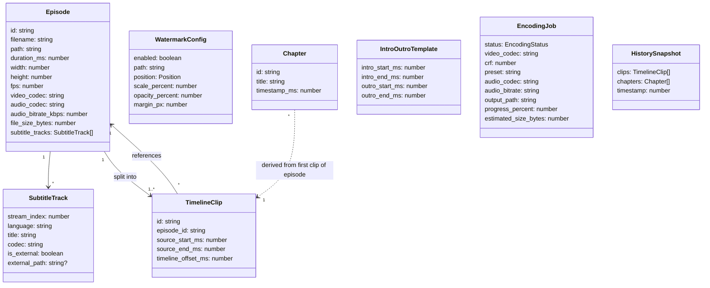
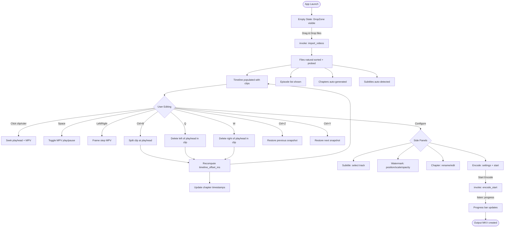
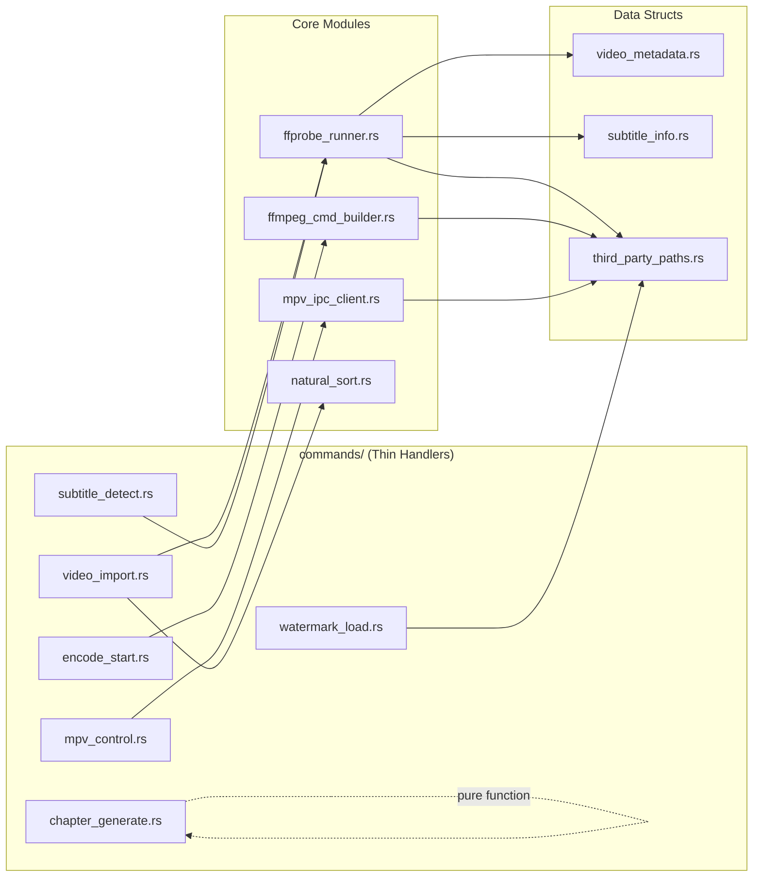
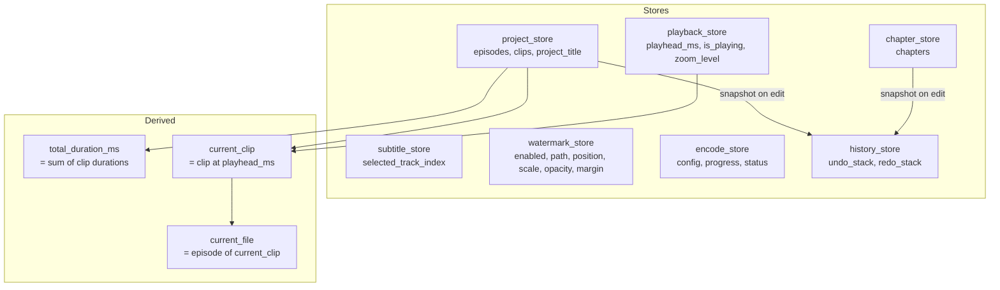
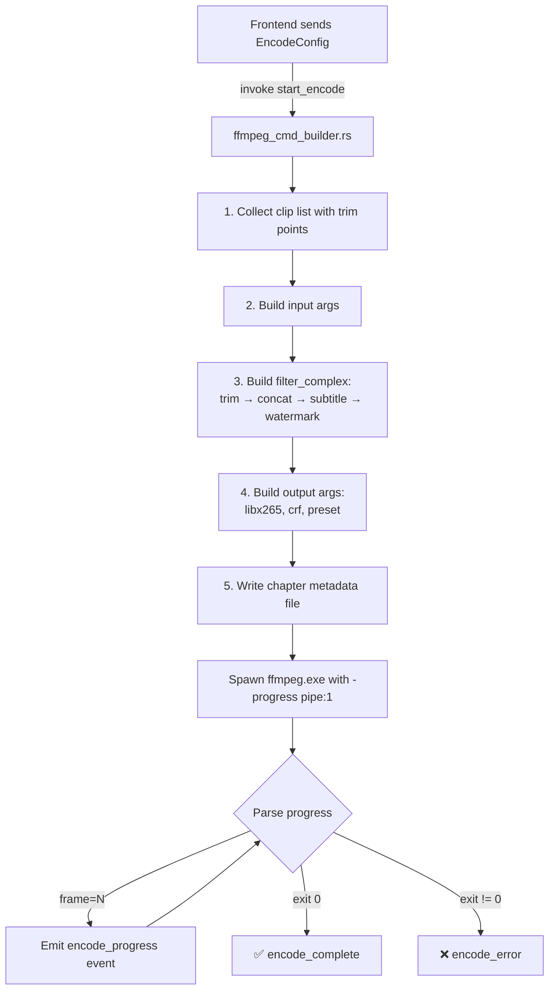
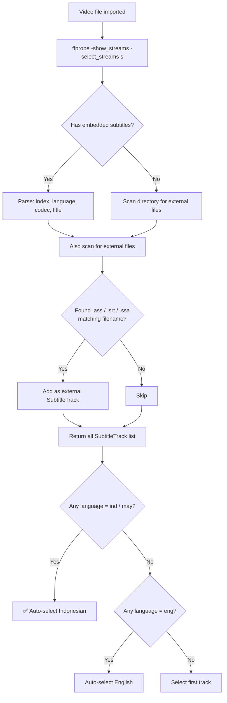

# Donghua Nexus — Architecture & Implementation Plan

---

## 1. High Level Architecture

```
┌───────────────────────────────────────────────────────────────┐
│                    FRONTEND (Svelte 5 + SvelteKit)            │
│                                                               │
│  ┌────────────┐  ┌──────────────┐  ┌────────────────────────┐ │
│  │ Import     │  │ Timeline     │  │ Side Panel             │ │
│  │ DropZone   │  │ Editor       │  │ (Subtitle / Watermark  │ │
│  │ + Episode  │  │ (Track,Clip, │  │  Chapter / Encode)     │ │
│  │   List     │  │  Ruler,Head) │  │                        │ │
│  └─────┬──────┘  └──────┬───────┘  └───────────┬────────────┘ │
│        │                │                      │              │
│        └────────────────┴──────────────────────┘              │
│                         │ invoke()                            │
│                         │ listen() (events)                   │
├─────────────────────────┼─────────────────────────────────────┤
│                    BACKEND (Rust / Tauri v2)                  │
│                         │                                     │
│  ┌──────────────────────▼──────────────────────────────┐      │
│  │              Tauri Command Handlers                 │      │
│  │  (thin layer — validate, delegate, return)          │      │
│  └──┬──────────┬──────────┬──────────┬────────────┬────┘      │
│     │          │          │          │            │            │
│  ┌──▼───┐  ┌──▼────┐  ┌──▼────┐  ┌─▼──────┐  ┌──▼────────┐  │
│  │ffprob│  │ffmpeg │  │mpv    │  │subtitle│  │natural    │  │
│  │e_run │  │_cmd   │  │_ipc   │  │_detect │  │_sort      │  │
│  │ner   │  │_build │  │_client│  │or      │  │           │  │
│  └──┬───┘  └──┬────┘  └──┬────┘  └─┬──────┘  └───────────┘  │
│     │         │          │         │                          │
│     ▼         ▼          ▼         ▼                          │
│  ffprobe   ffmpeg      mpv      ffprobe                      │
│   .exe      .exe       .exe      .exe                        │
│                                                               │
│  PATH: D:\Documents\GitHub\third-party\{ffmpeg,mpv}\          │
└───────────────────────────────────────────────────────────────┘
```

### Arsitektur: Command-Response + Event Stream

| Pola | Digunakan Untuk | Alasan |
|------|----------------|--------|
| **Command-Response** (`invoke()`) | Import, probe, subtitle detect, chapter generate, encode start | Request → process → return result. Sinkron dari perspektif frontend. |
| **Event Stream** (`listen()`) | Encode progress, MPV playback position | Backend push data ke frontend terus-menerus. Cocok untuk real-time feedback. |

### Kenapa Arsitektur Ini?

1. **Rust stateless per-command** — Setiap `invoke()` menerima data yang dibutuhkan, memproses, mengembalikan hasil. Tidak menyimpan state di Rust (kecuali MPV connection). Ini membuat debugging mudah: input masuk, output keluar, selesai.

2. **Frontend sebagai single source of truth** — Semua project state (episodes, clips, chapters, subtitle selection, watermark config) hidup di Svelte stores. Keuntungan: undo/redo hanya perlu snapshot Svelte state tanpa sinkronisasi Rust state.

3. **External processes, bukan library binding** — FFmpeg dan MPV dijalankan via `std::process::Command`. Tidak ada FFI, tidak ada build complexity. Kalau FFmpeg crash, app tetap hidup.

4. **MPV sebagai window terpisah** — MPV berjalan sebagai OS window tersendiri, dikontrol via JSON IPC melalui Named Pipe. Ini menghindari complexity embedding MPV ke dalam webview (HWND parenting, GPU context sharing, dll).

---

## 2. Folder Structure

```
donghua-nexus/
├── src/                              # Frontend (SvelteKit SPA)
│   ├── app.html                      # HTML shell
│   ├── app.css                       # Global styles, dark theme
│   ├── lib/
│   │   ├── types/
│   │   │   └── index.ts              # Semua TypeScript interfaces
│   │   ├── tauri_commands.ts         # Typed wrappers untuk invoke()
│   │   ├── keyboard_shortcuts.ts     # Global shortcut handler
│   │   ├── stores/
│   │   │   ├── project_store.svelte.ts   # Episodes + TimelineClips
│   │   │   ├── playback_store.svelte.ts  # Playhead + play state
│   │   │   ├── subtitle_store.svelte.ts  # Subtitle selection
│   │   │   ├── watermark_store.svelte.ts # Watermark config
│   │   │   ├── chapter_store.svelte.ts   # Chapter list
│   │   │   ├── encode_store.svelte.ts    # Encode config + progress
│   │   │   └── history_store.svelte.ts   # Undo/redo stack
│   │   └── components/
│   │       ├── import/
│   │       │   ├── DropZone.svelte
│   │       │   └── EpisodeList.svelte
│   │       ├── timeline/
│   │       │   ├── Timeline.svelte       # Container
│   │       │   ├── TimelineRuler.svelte  # Time ruler
│   │       │   ├── TimelineTrack.svelte  # Track row
│   │       │   ├── TimelineClip.svelte   # Clip block
│   │       │   └── Playhead.svelte       # Cursor line
│   │       ├── preview/
│   │       │   └── PreviewPlayer.svelte  # MPV controls
│   │       ├── subtitle/
│   │       │   └── SubtitlePanel.svelte
│   │       ├── watermark/
│   │       │   └── WatermarkPanel.svelte
│   │       ├── chapter/
│   │       │   └── ChapterPanel.svelte
│   │       ├── encode/
│   │       │   └── EncodePanel.svelte
│   │       └── shared/
│   │           ├── TimeInput.svelte      # HH:MM:SS.mmm
│   │           └── IconButton.svelte
│   └── routes/
│       ├── +layout.svelte               # App shell
│       ├── +layout.ts                   # SSR off
│       └── +page.svelte                 # Single page editor
│
├── src-tauri/                        # Backend (Rust)
│   ├── Cargo.toml
│   ├── tauri.conf.json
│   ├── build.rs
│   ├── src/
│   │   ├── main.rs                   # Entry point
│   │   ├── lib.rs                    # Builder + command registration
│   │   ├── third_party_paths.rs      # Const paths ke exe
│   │   ├── video_metadata.rs         # VideoMetadata struct
│   │   ├── subtitle_info.rs          # SubtitleTrack struct
│   │   ├── natural_sort.rs           # Natural filename sort
│   │   ├── ffprobe_runner.rs         # Jalankan ffprobe, parse JSON
│   │   ├── ffmpeg_cmd_builder.rs     # Build FFmpeg args
│   │   ├── mpv_ipc_client.rs         # Named Pipe IPC ke MPV
│   │   └── commands/
│   │       ├── mod.rs
│   │       ├── video_import.rs       # Import + probe
│   │       ├── mpv_control.rs        # MPV play/pause/seek
│   │       ├── subtitle_detect.rs    # Detect subtitle tracks
│   │       ├── watermark_load.rs     # Validate watermark PNG
│   │       ├── chapter_generate.rs   # Auto-generate chapters
│   │       └── encode_start.rs       # Start encoding
│   ├── capabilities/
│   └── icons/
│
├── static/
├── svelte.config.js
├── vite.config.js
├── tsconfig.json
└── package.json
```

### Alasan Struktur

| Keputusan | Alasan |
|-----------|--------|
| **`stores/` terpisah per concern** | Menghindari giant state. Setiap store 50-100 baris, mudah dibaca. |
| **`commands/` terpisah dari logic** | Command handler hanya validate + delegate. Business logic di module level atas (`ffprobe_runner.rs`, `mpv_ipc_client.rs`). |
| **`types/index.ts` satu file** | Interfaces kecil (< 200 baris total). Satu file lebih convenient daripada 10 file 20 baris. |
| **`tauri_commands.ts` satu file** | Semua IPC calls di satu tempat. Kalau Rust command berubah, hanya edit 1 file. |
| **`components/` by feature** | `import/`, `timeline/`, `preview/` — mudah menemukan file yang relevan. |
| **Tidak ada `utils.rs`** | Setiap module memiliki nama yang menjelaskan isi. `natural_sort.rs` bukan `utils.rs`. |

---

## 3. Domain Model



### Penjelasan Domain

| Entity | Tanggung Jawab |
|--------|---------------|
| **Episode** | Representasi 1 file video input. Immutable setelah import. Berisi metadata dari ffprobe. |
| **TimelineClip** | Potongan dari Episode yang muncul di timeline. Saat import, 1 Episode = 1 Clip. Setelah split, 1 Episode = N Clips. `source_start_ms`/`source_end_ms` merujuk posisi di file asli. `timeline_offset_ms` adalah posisi di output timeline (dihitung otomatis). |
| **SubtitleTrack** | Track subtitle dari MKV/MP4 atau file external. Detected oleh ffprobe. |
| **WatermarkConfig** | Konfigurasi overlay watermark. Singleton — hanya 1 watermark aktif. |
| **Chapter** | MKV chapter marker. Auto-generated dari episode boundaries, bisa diedit manual. |
| **IntroOutroTemplate** | Template cut intro/outro yang bisa di-apply ke banyak episode sekaligus. |
| **EncodingJob** | State encoding process. Progress di-emit sebagai event dari Rust. |
| **HistorySnapshot** | Snapshot state untuk undo/redo. Hanya menyimpan `clips` + `chapters` (data yang berubah saat edit). |

### Kenapa `TimelineClip` Terpisah dari `Episode`?

Saat user melakukan split (Ctrl+B), 1 clip menjadi 2 clip. Saat user delete (Q/W), 1 clip bisa hilang. Tapi Episode tetap tidak berubah — file asli masih di disk. TimelineClip adalah "view" ke Episode yang bisa di-manipulasi.

### Kenapa Semua Waktu dalam Milliseconds (`_ms`)?

- Integer — tidak ada floating point precision issues
- Cukup presisi untuk frame-level editing (1 frame @30fps = 33.3ms)
- Mudah di-convert: `ms / 1000` = detik, `ms / 60000` = menit
- Konsisten di seluruh codebase

---

## 4. Frontend Flow



### UI Layout

```
┌──────────────────────────────────────────────────────────────┐
│  Menu Bar: [File ▾] [Edit ▾]                    Donghua Nexus│
├────────────┬─────────────────────────┬───────────────────────┤
│            │                         │                       │
│  EPISODE   │     MPV PREVIEW         │    SIDE PANEL         │
│  LIST      │     (external window    │    ┌─ Subtitle ─┐    │
│            │      or placeholder)    │    │  ☑ Indo     │    │
│  Ep 1  ✓  │                         │    │  ☐ Eng      │    │
│  Ep 2  ✓  │     ▶ ‖ ◀◀ ▶▶          │    │  ☐ Chi      │    │
│  Ep 3  ✓  │     00:05:23 / 07:12:00 │    ├─ Watermark ─┤    │
│  ...      │                         │    │  ☑ Enabled  │    │
│            │                         │    │  Top-Right  │    │
│            │                         │    │  Scale: 10% │    │
│            │                         │    ├─ Chapter ───┤    │
│            │                         │    │  Ep1 00:00  │    │
│            │                         │    │  Ep2 23:41  │    │
│            │                         │    ├─ Encode ────┤    │
│            │                         │    │  HEVC x265  │    │
│            │                         │    │  CRF: 23    │    │
│            │                         │    │  [Encode]   │    │
├────────────┴─────────────────────────┴───────────────────────┤
│  TIMELINE                                                    │
│  00:00   05:00   10:00   15:00   20:00   25:00              │
│  ▼ (playhead)                                                │
│  ┌──────┬──────┬──────┬──────┬──────┐  Video Track          │
│  │ Ep 1 │ Ep 2 │ Ep 3 │ Ep 4 │ Ep 5 │                      │
│  └──────┴──────┴──────┴──────┴──────┘                       │
│  ┌──────────────────────────────────┐  Subtitle Track       │
│  │ ░░░░░░░░░░░░░░░░░░░░░░░░░░░░░░ │                       │
│  └──────────────────────────────────┘                       │
│  ┌──────────────────────────────────┐  Watermark Track      │
│  │ ████████████████████████████████ │                       │
│  └──────────────────────────────────┘                       │
│                                        Zoom: [- ════○═ +]   │
└──────────────────────────────────────────────────────────────┘
```

---

## 5. Backend Flow

### Rust Module Responsibilities



### Backend IPC Contract

| Command | Input | Output | Async? |
|---------|-------|--------|--------|
| `import_videos` | `paths: string[]` | `Episode[]` | ✅ (ffprobe per file) |
| `detect_subtitles` | `path: string` | `SubtitleTrack[]` | ✅ |
| `mpv_start` | `—` | `void` | ✅ (spawn process) |
| `mpv_load_file` | `path: string, start_sec: f64` | `void` | ✅ |
| `mpv_seek` | `time_sec: f64` | `void` | ✅ |
| `mpv_toggle_pause` | `—` | `void` | ✅ |
| `mpv_frame_step` | `direction: "forward" \| "backward"` | `void` | ✅ |
| `mpv_set_subtitle` | `path: string, index: number` | `void` | ✅ |
| `mpv_set_watermark` | `WatermarkConfig` | `void` | ✅ |
| `mpv_stop` | `—` | `void` | ✅ |
| `load_watermark` | `path: string` | `{width, height}` | ✅ |
| `generate_chapters` | `{title, duration_ms}[]` | `Chapter[]` | ❌ (pure) |
| `estimate_output` | `EstimateInput` | `EstimateResult` | ❌ (pure) |
| `start_encode` | `EncodeConfig` | `void` | ✅ (spawns ffmpeg) |

**Event**: `encode_progress` — emitted dari Rust saat encoding berjalan, berisi `{percent, eta_seconds, current_frame, total_frames}`.

### MPV Process Lifecycle

```
App Start → [MPV belum berjalan]
  │
  ▼  (user pertama kali play)
mpv_start → spawn mpv.exe --idle --input-ipc-server=\\.\pipe\donghua-mpv
  │
  ▼  [MPV idle, menunggu command]
  │
  ▼  (user import video)
mpv_load_file → loadfile + seek
  │
  ▼  [MPV playing/paused — dikontrol via IPC]
  │
  ▼  (app close)
mpv_stop → quit command via IPC → process exit
```

**State di Rust**: Hanya `Mutex<Option<MpvIpcClient>>` di `tauri::State`. Ini satu-satunya mutable state di backend — diperlukan karena MPV process harus persistent sepanjang sesi.

---

## 6. State Management Design

### Prinsip

1. **Svelte 5 Runes** — `$state()`, `$derived()`. Tidak ada external library.
2. **Terpisah per domain** — 7 store files, masing-masing < 100 baris.
3. **Immutable updates** — Setiap mutasi membuat array/object baru (needed untuk reactivity dan undo/redo).
4. **Derived over stored** — `total_duration_ms`, `current_clip`, dll dihitung, bukan disimpan.

### Store Map



### Kenapa Bukan 1 Giant Store?

```
❌ Giant store:
   project = $state({
     episodes: [], clips: [], playhead: 0, is_playing: false,
     subtitle: null, watermark: {...}, chapters: [], encode: {...}
   })
   
   Masalah:
   - 1 perubahan playhead triggers re-render seluruh app
   - Sulit di-debug: "apa yang berubah?"
   - Undo/redo harus snapshot SEMUA data

✅ Separate stores:
   - playhead berubah → hanya Playhead.svelte re-render
   - clips berubah → hanya Timeline re-render
   - Undo/redo hanya snapshot clips + chapters
```

### Computed Values (Derived)

| Value | Source | Formula |
|-------|--------|---------|
| `total_duration_ms` | `clips` | `clips.reduce((sum, c) => sum + (c.source_end_ms - c.source_start_ms), 0)` |
| `current_clip` | `clips`, `playhead_ms` | Clip dimana `timeline_offset_ms <= playhead < timeline_offset_ms + duration` |
| `current_episode` | `current_clip`, `episodes` | `episodes.find(e => e.id === current_clip.episode_id)` |
| `timeline_width_px` | `total_duration_ms`, `zoom_level` | `total_duration_ms * zoom_level * PIXELS_PER_MS` |

---

## 7. Timeline Data Structure

### Core Structure

```
Timeline = TimelineClip[]  (sorted by timeline_offset_ms, no gaps)
```

**Sangat sederhana.** Bukan tree, bukan linked list, hanya sorted array.

### Kenapa Array?

- Timeline ini hanya 1 video track, linear, no overlap, no gaps
- Operasi utama: split (insert), delete (remove + shift), seek (binary search)
- Untuk 100 episodes, array operations negligible (< 1ms)
- Mudah di-serialize untuk undo/redo

### Timeline Operations

#### Import (1 Episode → 1 Clip)
```
Input:   Episode{ id:"e1", duration: 23min }
Result:  TimelineClip{ 
           episode_id: "e1", 
           source_start_ms: 0, 
           source_end_ms: 1_380_000,
           timeline_offset_ms: <prev_clip_end>
         }
```

#### Split (Ctrl+B)
```
Before:  [  Clip A (0 — 23:00)  ]
                    ▲ playhead at 05:00
           
After:   [ Clip A1 (0—5:00) ][ Clip A2 (5:00—23:00) ]

Clip A1: source_start=0, source_end=5:00, offset=same
Clip A2: source_start=5:00, source_end=23:00, offset=A1.offset+5:00
```

#### Delete Left (Q) — Ripple Delete
```
Before:  [ Clip 1 ][ Clip 2 (0—23:00) ][ Clip 3 ]
                         ▲ playhead at 05:00

After:   [ Clip 1 ][ Clip 2' (5:00—23:00) ][ Clip 3 ]
                    ▲ everything shifts left by 5:00

Clip 2': source_start=5:00, source_end=23:00
Clip 3:  timeline_offset -= 5:00
Subtitle timestamps: -= 5:00 (for affected range)
Watermark: NO CHANGE (always full length)
```

#### Delete Right (W) — Ripple Delete
```
Before:  [ Clip 1 ][ Clip 2 (0—23:00) ][ Clip 3 ]
                         ▲ playhead at 18:00

After:   [ Clip 1 ][ Clip 2' (0—18:00) ][ Clip 3 ]
                                         ▲ Clip 3 shifts left

Clip 2': source_start=0, source_end=18:00
Clip 3:  timeline_offset -= 5:00
```

#### Recompute Offsets (setelah setiap edit)
```
function recompute_offsets(clips):
    offset = 0
    for clip in clips:
        clip.timeline_offset_ms = offset
        offset += (clip.source_end_ms - clip.source_start_ms)
```

O(n) setelah setiap edit. Untuk 100 clips = beberapa microseconds. Tidak perlu optimisasi.

### Intro/Outro Cut (Batch)

```
Template: intro_end = 01:31, outro_start = 22:03

Untuk setiap clip yang di-apply:
1. Split di intro_end (01:31) → [intro_clip, rest_clip]
2. Delete intro_clip
3. Split rest_clip di outro_start — adjusted → [content, outro_clip]  
4. Delete outro_clip
5. Recompute offsets
6. Update chapters
```

---

## 8. Undo/Redo Design

### Strategy: **Snapshot-Based**

```
undo_stack: HistorySnapshot[]   (max 50)
redo_stack: HistorySnapshot[]

HistorySnapshot = {
    clips: TimelineClip[]     // Deep copy
    chapters: Chapter[]        // Deep copy
}
```

### Kenapa Snapshot, Bukan Command Pattern?

| | Command Pattern | Snapshot |
|---|---|---|
| **Complexity** | Harus implement `execute()` + `undo()` per operasi | Hanya deep copy array |
| **Bugs** | Undo bisa out of sync jika command salah | Snapshot = ground truth |
| **Memory** | Lebih hemat | ~OK. 100 clips × 50 snapshots ≈ 500KB |
| **Implementation** | 500+ baris | ~50 baris |

### Flow

```
User melakukan edit (split/delete):
  1. Push current {clips, chapters} ke undo_stack
  2. Clear redo_stack
  3. Apply edit
  4. Recompute offsets + chapters

Ctrl+Z (Undo):
  1. Push current state ke redo_stack
  2. Pop dari undo_stack → restore clips + chapters

Ctrl+Y (Redo):
  1. Push current state ke undo_stack
  2. Pop dari redo_stack → restore clips + chapters
```

### Yang TIDAK di-undo:
- Subtitle selection (bukan timeline edit)
- Watermark config (bukan timeline edit)
- Encode config
- Playhead position

### Stack Size: **50 snapshots**
100 clips × 50 snapshots × ~100 bytes/clip = **~500KB**. Negligible.

---

## 9. Encoding Pipeline

### FFmpeg Command Construction

```
ffmpeg \
  -i episode1.mkv -i episode2.mkv -i episode3.mkv \
  -i watermark.png \
  -filter_complex "
    [0:v]trim=91.0:1323.0,setpts=PTS-STARTPTS[v0];
    [1:v]trim=91.0:1323.0,setpts=PTS-STARTPTS[v1];
    [2:v]trim=91.0:1323.0,setpts=PTS-STARTPTS[v2];
    [v0][v1][v2]concat=n=3:v=1:a=0[vmain];
    [0:a]atrim=91.0:1323.0,asetpts=PTS-STARTPTS[a0];
    [1:a]atrim=91.0:1323.0,asetpts=PTS-STARTPTS[a1];
    [2:a]atrim=91.0:1323.0,asetpts=PTS-STARTPTS[a2];
    [a0][a1][a2]concat=n=3:v=0:a=1[amain];
    [vmain]ass='subtitle.ass'[vsub];
    [vsub][3:v]overlay=W-w-20:20,colorchannelmixer=aa=0.7[vfinal]
  " \
  -map "[vfinal]" -map "[amain]" \
  -c:v libx265 -crf 23 -preset slow \
  -c:a aac -b:a 128k \
  output.mkv
```

### Pipeline Steps (di Rust)



### Audio Decision Logic

```
If source is AAC AND bitrate <= 192kbps:
    → -c:a copy     (no re-encode)
Else:
    → -c:a aac -b:a 128k
```

### Chapter Embedding via FFmpeg Metadata

```ini
;FFMETADATA1
[CHAPTER]
TIMEBASE=1/1000
START=0
END=1420000
title=Episode 1

[CHAPTER]
TIMEBASE=1/1000
START=1420000
END=2834000
title=Episode 2
```

Pass via: `ffmpeg -i metadata.txt -map_metadata 1 ...`

### Progress Tracking

FFmpeg `-progress pipe:1` outputs key=value pairs. Rust parses `out_time_ms` to calculate: `progress = out_time_ms / total_duration_ms × 100%`.

> [!IMPORTANT]
> Untuk 100+ episodes, `filter_complex` string bisa sangat panjang dan melebihi Windows command line limit (32K chars). Solusi: gunakan `-filter_complex_script tempfile.txt` yang membaca filter dari file.

---

## 10. Subtitle Detection Pipeline



### External Subtitle Matching

```
Video:    "Episode 01.mkv"
Scan:     "Episode 01.ass"     ✅ match (same stem)
          "Episode 01.srt"     ✅ match  
          "Episode 01.ind.ass" ✅ match (stem starts with same name)
          "Readme.txt"          ❌ not subtitle
```

### Language Detection Priority

1. `language` tag dari ffprobe (ISO 639-2: `ind`, `eng`, `chi`, `jpn`)
2. Filename suffix: `.ind.ass`, `.en.srt`
3. `title` tag: "Indonesian", "English"

### Subtitle untuk Burn-In saat Encode

| Source | Method |
|--------|--------|
| ASS/SSA embedded | Extract ke temp file → `ass=` filter |
| ASS/SSA external | Langsung `ass=path` filter |
| SRT embedded | Extract → `subtitles=` filter |
| SRT external | `subtitles=path` filter |

ASS filter mempertahankan semua styling (font, warna, posisi). SRT menggunakan default styling.

---

## 11. Output Estimation Strategy

### Pendekatan: **Lookup Table**

Bitrate dari CRF encoding tidak bisa dihitung exact (tergantung scene complexity). Kita gunakan lookup table dari benchmark real anime content:

| Resolution | CRF | Preset | Typical Bitrate (kbps) |
|------------|-----|--------|----------------------|
| 1920×1080 | 23 | slow | 1800–3000 |
| 1920×1080 | 23 | medium | 2000–3500 |
| 1280×720 | 23 | slow | 900–1500 |
| 1280×720 | 23 | medium | 1000–1800 |
| 3840×2160 | 23 | slow | 5000–8000 |

**Anime/donghua cenderung low-complexity** (flat colors, less grain) → gunakan lower end estimate.

### Formula

```
estimated_video_bitrate = lookup(resolution, crf, preset) × 0.85  // anime factor
estimated_audio_bitrate = 128kbps (or source if copy)
estimated_bytes = (video_bps + audio_bps) × duration_sec / 8
```

### Display

```
┌─────────────────────────────────┐
│  OUTPUT ESTIMATION              │
│                                 │
│  Resolution:   1920×1080        │
│  FPS:          24               │
│  Video Codec:  HEVC x265       │
│  Audio Codec:  AAC 128kbps     │
│  Duration:     07:12:31        │
│  Subtitle:     Indonesian (ASS)│
│                                 │
│  Source Size:   12.4 GB         │
│  Est. Output:   3.2 GB         │
│  Est. Saved:    9.2 GB (74%)   │
│                                 │
│  ⚠ Estimate may vary ±20%     │
└─────────────────────────────────┘
```

### Kenapa Bukan Sample Encode?

Sample encode (encode 30 detik dulu) lebih akurat, tapi memakan 30-60 detik. User ingin instant estimate. ±20% cukup untuk "berapa GB output-nya". Bisa ditambah sebagai optional feature di masa depan.

---

## 12. Risk & Tradeoff

### R1: MPV External Window

| | |
|---|---|
| **Risk** | Window terpisah, user manage 2 windows |
| **Mitigation** | Set MPV position via `--geometry` agar align dengan preview area |
| **Tradeoff** | 10x lebih simpel daripada embed. Embedding MPV butuh HWND parenting, GPU context sharing, platform-specific code |
| **Fallback** | Bisa migrate ke `libmpv` + custom Tauri plugin di masa depan |

### R2: Subtitle Rendering Difference

| | |
|---|---|
| **Risk** | MPV preview vs FFmpeg burn-in mungkin sedikit berbeda |
| **Mitigation** | Keduanya pakai `libass`. Perbedaan minor acceptable |

### R3: Large File Count (100 episodes)

| | |
|---|---|
| **Risk** | FFprobe 100 files lambat (100 × 0.5s = 50s) |
| **Mitigation** | Parallel probing (`tokio::spawn`, max 8 concurrent) + progress indicator |

### R4: FFmpeg Command Line Length Limit

| | |
|---|---|
| **Risk** | 100 episodes → filter_complex > 32K chars (Windows limit) |
| **Mitigation** | `-filter_complex_script tempfile.txt` membaca dari file |

### R5: MPV Named Pipe Disconnect

| | |
|---|---|
| **Risk** | MPV crash → pipe broken |
| **Mitigation** | Detect broken pipe → auto respawn MPV → show toast |

### R6: Audio Codec Mismatch antar Episode

| | |
|---|---|
| **Risk** | Episode 1 AAC, Episode 2 FLAC → concat butuh re-encode semua |
| **Mitigation** | Detect saat import. Jika heterogen → re-encode semua ke AAC 128k. Jika homogen AAC ≤192k → copy |

### R7: Variable Resolution antar Episode

| | |
|---|---|
| **Risk** | Episode 1 adalah 1080p, Episode 5 adalah 720p → concat error |
| **Mitigation** | Detect saat import → warn user → option: scale to lowest/highest common resolution |

---

## 13. Milestone Development Plan

### Milestone 1: Foundation — Import + Timeline + Preview

**Goal**: User bisa import video, lihat di timeline, preview di MPV.

| Item | Detail |
|------|--------|
| Rust modules | `third_party_paths`, `video_metadata`, `natural_sort`, `ffprobe_runner`, `mpv_ipc_client` |
| Rust commands | `import_videos`, `mpv_start/load/seek/pause/frame_step` |
| Frontend | `DropZone`, `EpisodeList`, `Timeline` (all sub-components), `PreviewPlayer` |
| Stores | `project_store`, `playback_store` |
| Infra | `app.css`, `types/index.ts`, `tauri_commands.ts`, dark theme |

**Deliverable**: Import 5 MKV → lihat di timeline → seek → play/pause di MPV.

**Est. effort**: 3-4 hari

---

### Milestone 2: Subtitle + Watermark + Chapter

**Goal**: Deteksi subtitle, konfigurasi watermark, auto-generate chapters.

| Item | Detail |
|------|--------|
| Rust commands | `detect_subtitles`, `load_watermark`, `generate_chapters` |
| Rust modules | `subtitle_info.rs` |
| Frontend | `SubtitlePanel`, `WatermarkPanel`, `ChapterPanel` |
| Stores | `subtitle_store`, `watermark_store`, `chapter_store` |
| MPV | `mpv_set_subtitle`, `mpv_set_watermark` (via MPV vf filter) |

**Deliverable**: Import MKV dengan subtitle → auto-detect Indo → watermark preview → chapters listed.

**Est. effort**: 2-3 hari

---

### Milestone 3: Editing — Split + Delete + Undo/Redo

**Goal**: User bisa cut video di timeline.

| Item | Detail |
|------|--------|
| Frontend logic | Split (Ctrl+B), Delete left (Q), Delete right (W) |
| Store | `history_store` (undo/redo stack) |
| Module | `keyboard_shortcuts.ts` |
| Auto | Recompute offsets + update chapters setelah edit |

**Deliverable**: Split → delete intro → delete outro → undo → redo. Auto-mepet.

**Est. effort**: 2-3 hari

---

### Milestone 4: Intro/Outro Template

**Goal**: Batch cut intro/outro semua episode sekaligus.

| Item | Detail |
|------|--------|
| Frontend | IntroOutroPanel UI (set template timestamps) |
| Logic | Apply to all / selected episodes |
| Integration | Batch split+delete → recompute → chapters update |

**Deliverable**: Set intro/outro → Apply All → semua terpotong.

**Est. effort**: 1-2 hari

---

### Milestone 5: Encoding Pipeline

**Goal**: Encode output MKV dengan HEVC x265.

| Item | Detail |
|------|--------|
| Rust | `ffmpeg_cmd_builder.rs` (full), `encode_start.rs` |
| Filter | concat + subtitle burn + watermark overlay |
| Audio | Codec decision logic (copy vs re-encode) |
| Chapter | Metadata file generation + embedding |
| Progress | `-progress pipe:1` + Tauri event emit |
| Frontend | `EncodePanel` + progress bar |
| Store | `encode_store` |

**Deliverable**: Click Encode → progress → output MKV + chapters + subtitle + watermark.

**Est. effort**: 3-4 hari

---

### Milestone 6: Output Estimation + Polish

**Goal**: Show estimated size. Polish UX.

| Item | Detail |
|------|--------|
| Logic | Lookup table estimation |
| UI | Estimation display in EncodePanel |
| Polish | Error handling, edge cases, window sizing |

**Deliverable**: Sebelum encode → user lihat estimated size + savings.

**Est. effort**: 1-2 hari

---

### Summary Timeline

| Milestone | Focus | Days |
|-----------|-------|------|
| M1 | Import + Timeline + Preview | 3-4 |
| M2 | Subtitle + Watermark + Chapter | 2-3 |
| M3 | Split + Delete + Undo/Redo | 2-3 |
| M4 | Intro/Outro Template | 1-2 |
| M5 | Encoding Pipeline | 3-4 |
| M6 | Estimation + Polish | 1-2 |
| **Total** | | **12-18 hari** |

> [!TIP]
> Milestone 1 paling kritis. Foundation (import → timeline → MPV) harus solid dulu. Milestone selanjutnya jauh lebih ringan karena hanya menambah fitur di atas infrastruktur yang sudah ada.
